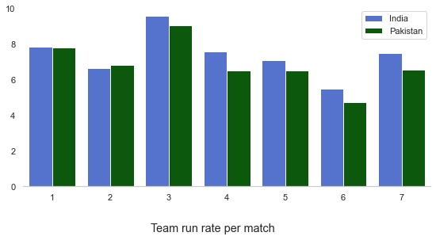

# ICC Men's T20 World Cup 2021

 Though football is one of the most popular games in the world but when it comes to cricket, ICC's tournaments are not far behind.
It doesn't matter, if you are a cricket fan or not, you must have encountered some cricket-based ads, blog links, and whatnot. So many promotional advertising messages and emails must have made you realize, how religiously people follow cricket and like to discuss it. In this blog, We would discuss this year's Cricket World Cup, various participating teams, their statistics, and past performances. We will be concluding our discussion by methodically predicting finalists, semi-finalists, and top teams in the qualifier round.

### Why prediction?

 Humans have always been curious about the future. Knowing what would happen in near future beforehand is no less than a superpower. Presently, researchers and scientists are using historical data to observe patterns to forecast/predict upcoming events so our lives can be easier. In statistics, the words prediction, forecasting, and estimation are identical and can be used interchangeably. "Prediction" more naively can be described as a well-informed guess or opinion. Therefore, in this article, we will use the magical power of historical data to predict the winners of the tournament before they actually win.

### Where to begin?

Before we procure our superpower to predict, We have to acquire the magical power of historical data first. There is a lot of cricket data available on the internet through different sources but most of them are outdated. For our problem, we need the latest data to make our predictions precise. The following links are some of the most credible sources for cricketing data.

For T-20 data : [ESPN_CricketInfo](https://stats.espncricinfo.com/ci/engine/stats/index.html?class=3;template=results;type=aggregate;view=results)

For IPL data : [HowStat](http://www.howstat.com/cricket/Statistics/IPL/MatchList.asp)

This source (espncricinfo) has all the ICC T20 match records along with full scorecards. I have used  **Beautifulsoup** , A python library for scraping data from a static webpage. If you are curious about how to do it, You can click here to check the source code.
Now we have acquired our magical power of historical data, our next step would be to explore this power so we can use it for good.

### Exploring magical power "Data"

We have 1374 T20 match records from 17th-Feb-2005 till 18th-Oct-2021. We will be using only those matches which resulted in a "win" for either team, removing " n/r or tied ".

Let's consider the  most hyped "India vs Pakistan" upcoming match and analyze it

The above figure shows the head to head win percentages for both the team. It is evident that india has performed well between the two.

 
 

**Now we will compare their batting, and see who dominated the batting department**

 

More number of players scored 30+ runs and led pakistan to victory in third match.
Apparently, only one player scored 30+ in following matches from pakistan greecing the wheels for india's win.

 

Scoring at better run rates than pakistan in most matches evince win for india.

 
 

**Lets explore the bowling aspect of both teams**

 

Initially, indian bowling had rewarded pakistan with few extras which seem to be imporved in latter matches.
Lets have a glance over the bowling economy to get a clear distinction between the two teams.
 

Above infographic evince an economical bowling of indian team, 
